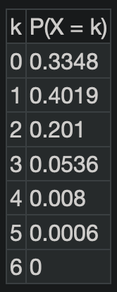

# **Homework #10 - Binomial Distributions**
### **OpenStax** pg.293 #94, 95**, 96, 98, 100**
**For problems 95 and 100, I included the geogebra distribution table.

**94**
    
    a.  X = the

    b.

    c.

    d.

    e.
    
    f.

**95**
    
    a. 

    b.

    c.

    d.

    e.
    
    f.

