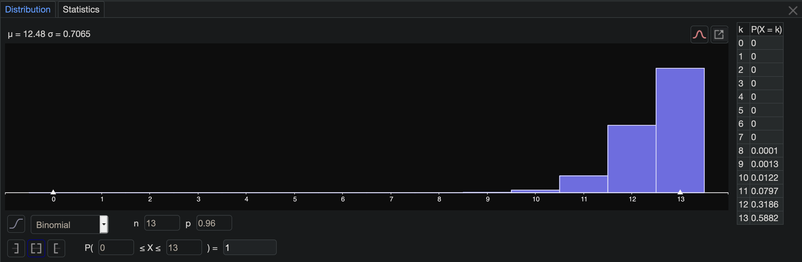
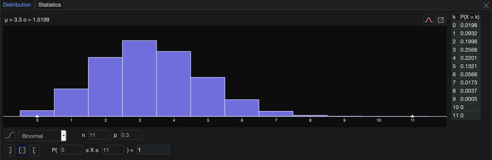

# **Homework #10 - Binomial Distributions**
### **OpenStax** pg.293 #94, 95**, 96, 98, 100**
**For problems 95 and 100, I included the geogebra distribution table.

## **94**
    
    a. X = "The number of times a die shows a 1 out of 6 trials. (0-6 times)

    b. X = 0,1,2,3,4,5,6

    d. μ = 1.0002 ~ 1 dice

    e. P(X = 6) is 1
    
    f. [n = 3] P(X = 3) is 1 , n = 4 P(X = 4) is still 1

## **95****
    
    a. X = "The number number of institutions that offer distance learning courses out of 13 trials. (0-13 schools)

    b. X = 0,1,2,3,4,5,6,7,8,9,10,11,12,13

    d. μ = 12.48 ≈ 12 schools

    e. P(X ≤ 10) is .0135
    
    f. On average 11.52/12 schools offer offer such courses, and on average 12.48/13 schools offer such courses. Still the same percentage, so there is not a difference between 12 and 13 trials.

## **96**
    
    a. X = "The number number of graduating students that attend their graduation out of 20 trials. (0-22 students)

    b. X = 0,1,2,3,4,5,6,7,8,9,10,11,12,13,14,15,16,17,18,19,20,21,22

    d. μ = 18.7 ≈ 19 students

    e. P(17 or 18) = .1262 + .1987 = .32

    f. I wouldn't be very suprised, because the average that shows up is about 19/22 students.

## **98**

    a. X = "The number of seniors who participated in after-school sports all four years of high school out of 60 trials. (0-60 seniors)

    b. X = 0 1 2 3 4 5 6 7 8 9 10 11 12 13 14 15 16 17 18 19 20 21 22 23 24 25 26 27 28 29 30 31 32 33 34 35 36 37 38 39 40 41 42 43 44 45 46 47 48 49 50 51 52 53 54 55 56 57 58 59 60

    d. μ = 36 seniors

    e. P(17 or 18) = .1262 + .1987 = .32

    f. I wouldn't be very suprised, because on average 60 percent of the students have participated in after-school sports all four years of high school

## **100****

    a. X = "The number of California residents that have adequate earthquake supplies out of 11 trials. (0-11 residents)

    b. X = 0 1 2 3 4 5 6 7 8 9 10 11

    d. P(X ≧ 8) = .0043

    e. It is more likely that none will have adequate earthquake supplies than all of them, because 30% is closer to 0% than 100%.

    f. Based on the average I would expect about 3 residents to have adequate earthquake supplies.

